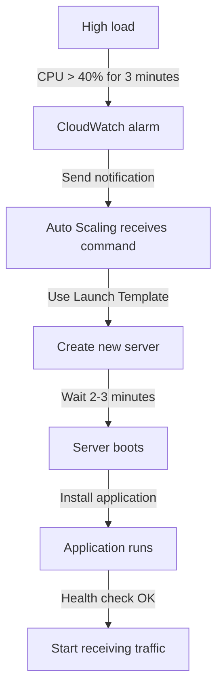
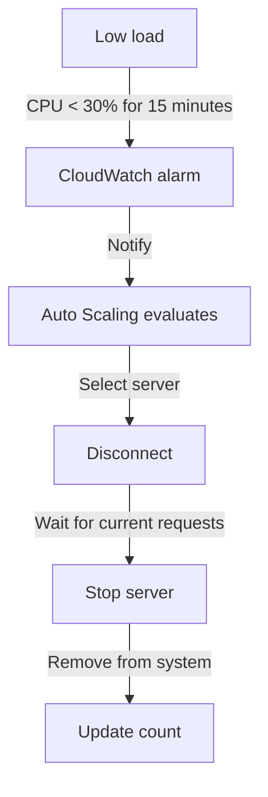

+++
title = "Auto Scaling Flow"
weight = 2
pre = "<b>9.2 </b>"
+++

## Part 1: Understanding Auto Scaling

### 1.1 What is Auto Scaling?
Auto Scaling is a feature that automatically increases/decreases the number of EC2 instances based on system load. It acts like a "smart manager" that automatically hires or reduces servers as needed.

### 1.2 Key Components
1. **Auto Scaling Group (ASG)**
   - Acts as a "management team" for servers
   - Decides when to add/remove servers
   - Maintains desired server count

2. **Launch Template**
   - "Blueprint" for new servers
   - Contains all necessary information:
     + Machine type (t2.medium)
     + Operating system (Ubuntu)
     + Security groups
     + Required applications

3. **Target Group**
   - "Working group" of servers
   - Monitors health of each server
   - Distributes workload evenly

## Part 2: Detailed Operation Flow

### 2.1 When System Load Increases (Scale Out)



### 2.2 When System Load Decreases (Scale In)



## Part 3: Auto Scaling Process

When our website experiences high traffic, the Auto Scaling system automatically adjusts the number of EC2 instances to handle the load. To monitor this process, we need to track metrics through CloudWatch, EC2, and Auto Scaling Groups.

To simulate this part, we'll run the k6 tool again.


### 3.1 CloudWatch Dashboard

#### 1. **Accessing Auto Scaling Metrics**
- First, go to Auto Scaling groups
- Select the created Auto Scaling group to view details


#### 2. **View EC2 Metrics**
- Select the Monitoring tab
- Click on EC2 to view detailed metrics
- This provides statistical information about **EC2** such as **CPU, Memory, Network, Disk**, ... enabling more flexible and accurate observation and handling when issues occur.


#### 3. **CloudWatch Alarms**
- However, the above only shows EC2 metrics. To view Auto Scaling metrics, we need to access CloudWatch Alarms
- First, click on All Alarms. Since we configured CloudWatch metrics during Auto Scaling setup, there will be pre-created alarms
- Next to the Alarm Names are States. To see the changes, click on the State labeled "OK"


#### 4. Alarms
After accessing, you'll see an interface like this:


Besides the OK State, there are others like In Alarm, Insufficient Data.

1. **In Alarm - Alarm Low**
- Triggers when CPU < 28% for 15 consecutive minutes
- Currently in alarm state
- Allows action to decrease instances

2. **OK - Alarm High**
- Triggers when CPU > 40% for 3 consecutive minutes
- Currently in normal state
- Allows action to increase instances

3. **Insufficient Data - Demo Alarm**
- Triggers when CPU > 70% for 3 consecutive minutes
- Currently lacks data for evaluation
- Used for Auto Scaling demonstration

#### 5. **Monitoring Changes**
- The k6 tool has taken effect, now the graph shows an upward trend meaning requests have increased performance


Let's move to section 3.2 to see how EC2 and Auto Scaling Group have been affected.

### 3.2 EC2 and Auto Scaling Group
#### 1. **EC2 Scale Out**
- Access EC2 instances

Additional EC2 instances have been created and are running, showing the Scale Out effect in action.

- If EC2 instances become unhealthy, they will automatically terminate and create new ones as replacements.

#### 2. **EC2 Scale In**
- When CloudWatch **In alarm** detects decreased requests, EC2 will automatically reduce the number of instances
- As here, the k6 tool has finished running and requests have dropped below 30% of initial levels, triggering Scale In. Therefore, EC2 will self-terminate.


#### 3. **Auto Scaling Group**
- To view activity history, access the Activity tab, which includes information about creation history in Auto Scaling.


## Part 4: Troubleshooting

### 4.1 Common Issues

1. **Cannot Create New Server**
```bash
Check:
✓ Launch Template errors?
✓ Correct Security group?
✓ Sufficient IAM role permissions?
✓ Available IPs in subnet?
```

2. **Health Check Failure**
```bash
Verify:
✓ Is app running?
✓ Is port 9000 open?
✓ Is /health endpoint OK?
✓ Does Security group allow traffic?
```

### 4.2 Daily Checklist

```bash
Morning:
□ Check instance count
□ View average CPU
□ Verify no errors

Afternoon:
□ Check response time
□ View scaling events
□ Check error logs

Evening:
□ Verify backup
□ Check costs
□ Plan for tomorrow
```

{}
**Useful Tips:**
1. Always set sufficient Warm-up time (≥ 300s)
2. Monitor error logs
3. Set alerts for important metrics
4. Backup Launch Template
5. Test health check endpoint regularly
{}

{}
**Important Warnings:**
1. Don't delete active Launch Template
2. Don't change Security Group suddenly
3. Always maintain minimum 2 instances
4. Backup before major changes
{}

### Complete!