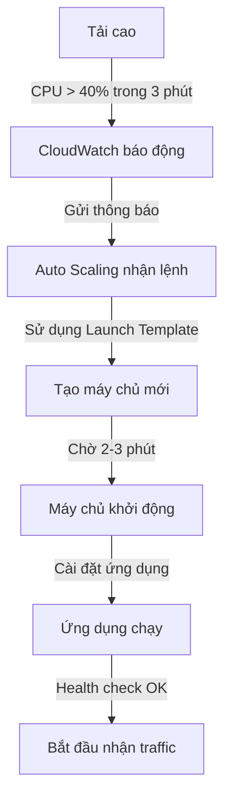
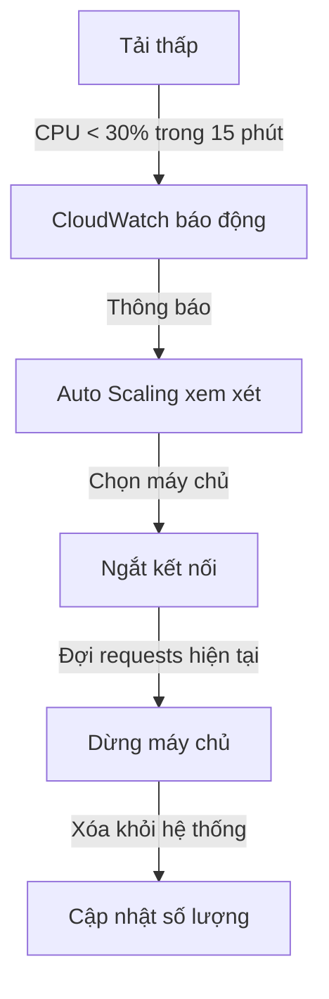

+++
title = "Luồng hoạt động Auto Scaling"
weight = 2
pre = "<b>9.2 </b>"
+++

## Phần 1: Hiểu Về Auto Scaling

### 1.1 Auto Scaling Là Gì?
Auto Scaling là tính năng tự động tăng/giảm số lượng EC2 instances dựa trên tải của hệ thống. Giống như một "quản lý thông minh" tự động thuê thêm hoặc giảm bớt máy chủ khi cần.

### 1.2 Các Thành Phần Chính
1. **Auto Scaling Group (ASG)**
   - Như một "đội quản lý" máy chủ
   - Quyết định khi nào thêm/bớt máy chủ
   - Duy trì số lượng máy chủ mong muốn

2. **Launch Template**
   - "Bản thiết kế" cho máy chủ mới
   - Chứa mọi thông tin cần thiết:
     + Loại máy (t2.medium)
     + Hệ điều hành (Ubuntu)
     + Security groups
     + Ứng dụng cần cài đặt

3. **Target Group**
   - "Nhóm làm việc" của các máy chủ
   - Kiểm tra sức khỏe từng máy
   - Phân phối công việc đều cho các máy

## Phần 2: Luồng Hoạt Động Chi Tiết

### 2.1 Khi Hệ Thống Tăng Tải (Scale Out)



### 2.2 Khi Hệ Thống Giảm Tải (Scale In)



## Phần 3: Quá Trình Auto Scaling

Khi website của chúng ta có lượng truy cập tăng cao, hệ thống Auto Scaling sẽ tự động điều chỉnh số lượng EC2 instances để đáp ứng tải. Để theo dõi quá trình này, chúng ta cần giám sát các metrics thông qua CloudWatch, EC2 và Auto Scaling Groups.

Để giả lập phần này mình sẽ chạy lại tool k6 một lần nữa.

### 3.1 CloudWatch Dashboard

#### 1. **Truy Cập Metrics Auto Scaling**
- Đầu tiên, vào Auto Scaling groups
- Chọn Auto Scaling group đã tạo để xem chi tiết


#### 2. **Xem Metrics EC2**
- Chọn tab Monitoring 
- Nhấp vào EC2 để xem các metrics chi tiết
- Ở đây sẽ cung cấp các thông tin thống kê về **EC2** như **CPU, Memory, Network, Disk**, ... Điều này giúp cho việc quan sát và xử lý khi có sự có được linh hoạt và chính xác hơn.


#### 3. **CloudWatch Alarms**
- Thế nhưng ở trên chỉ là các metrics của EC2, để xem được các metrics của Auto Scaling thì chúng ta cần đến CloudWatch Alarms
- Đầu tiên sẽ cần ấn vào All Alarms, vì đã cấu hình lúc cài Auto Scaling đã có metrics CloudWatch nên sẽ có các alarms được tạo sẵn như sau
- Ở cạnh Name của Alarms sẽ có các State, để xem sự biến động ta ấn vào State có tên là **OK**


#### 4. Alarms
Sau khi truy cập vào sẽ hiện ra giao diện như sau


Ngoài State OK ra còn có các cái khác như In Alarm, Insufficient Data.

1. **In Alarm - Alarm Low**
- Kích hoạt khi CPU < 28% trong 15 phút liên tiếp
- Đang trong trạng thái báo động (In alarm)
- Cho phép thực hiện hành động giảm instances

2. **OK - Alarm High**
- Kích hoạt khi CPU > 40% trong 3 phút liên tiếp
- Hiện đang ở trạng thái bình thường (OK)
- Cho phép thực hiện hành động tăng instances

3. **Insufficient Data - Demo Alarm**
- Kích hoạt khi CPU > 70% trong 3 phút liên tiếp
- Đang thiếu dữ liệu để đánh giá (Insufficient data)
- Được dùng cho mục đích demo Auto Scaling

#### 5. **Theo dõi sự biến đổi**
- Tác động của k6 đã có hiệu quả, giờ ở phần biểu đồ đã có phần đi lên có nghĩa là lượt request đã làm tăng hiệu suất


#### Giờ hãy cùng qua phần 3.2 để xem EC2 và Auto Scaling Group đã bị ảnh hưởng như nào.

### 3.2 EC2 và Auto Scaling Group
#### 1. **EC2 Scale Out**
- Truy cập vào EC2 instance

Đã có thêm EC2 instance đã được tạo thêm và đang chạy, như vậy hiệu quả của việc Scale Out đã được thực hiện.

- Trong trường hợp các EC2 bị unhealthy thì nó sẽ tự terminal và tạo thêm EC2 mới để thay thế.

#### 2. **EC2 Scale In**
- Khi CloudWatch **In alarm** phát hiện lượt request giảm xuống thì EC2 sẽ tự động giảm số lượng instances.
- Như ở đây tool k6 đã chạy xong và lượt request giảm xuống thấp hơn 30% so với ban đầu nên sẽ có hiệu ứng Scale In. Vì vậy EC2 sẽ tự terminate.


#### 3. **Auto Scaling Group**
- Để xem lịch sử hoạt động ta sẽ truy cập vào tab Activity, bên trong sẽ bao gồm các thông tin về lịch sử tạo trên Auto Scaling.

## Phần 4: Xử Lý Sự Cố

### 4.1 Các Vấn Đề Thường Gặp

1. **Máy Chủ Không Thể Tạo Mới**
```bash
Kiểm tra:
✓ Launch Template có lỗi?
✓ Security group đúng chưa?
✓ IAM role đủ quyền?
✓ Subnet còn IP trống?
```

2. **Health Check Thất Bại**
```bash
Verify:
✓ App có chạy không?
✓ Port 9000 có mở không?
✓ /health endpoint có OK?
✓ Security group cho phép traffic?
```

### 4.2 Checklist Hàng Ngày

```bash
Sáng:
□ Kiểm tra số lượng instances
□ Xem CPU trung bình
□ Verify không có lỗi

Chiều:
□ Kiểm tra response time
□ Xem scaling events
□ Check error logs

Tối:
□ Verify backup
□ Kiểm tra chi phí
□ Lên kế hoạch cho ngày mai
```

{}
**Mẹo Hữu Ích:**
1. Luôn để Warm-up đủ dài (≥ 300s)
2. Monitor cả error logs
3. Đặt alerts cho các metrics quan trọng
4. Backup Launch Template
5. Test health check endpoint thường xuyên
{}

{}
**Cảnh Báo Quan Trọng:**
1. Không xóa Launch Template đang dùng
2. Không thay đổi Security Group đột ngột
3. Luôn giữ minimum 2 instances
4. Backup trước khi thay đổi lớn
{}

### Hoàn Thành!